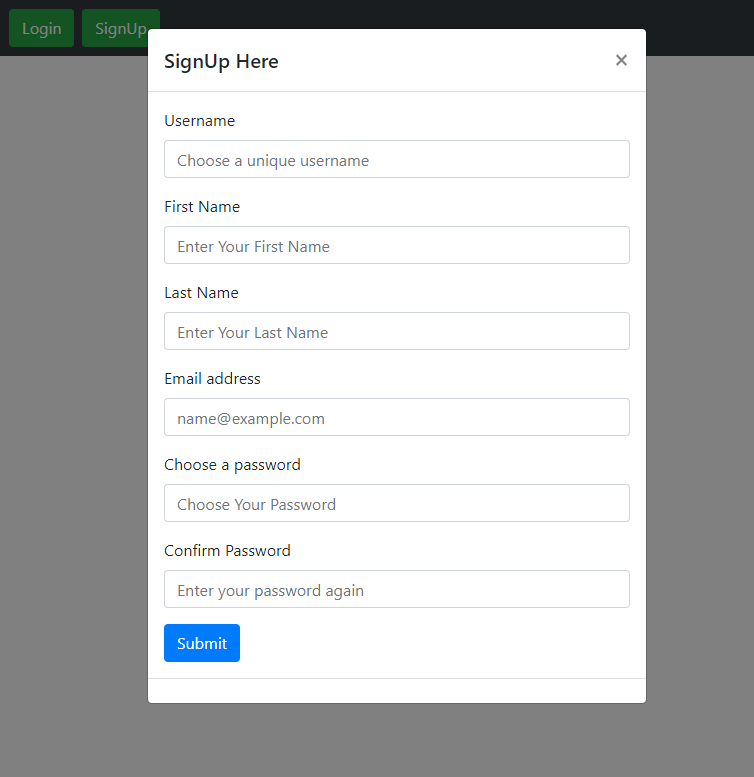
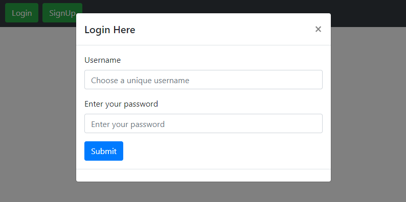
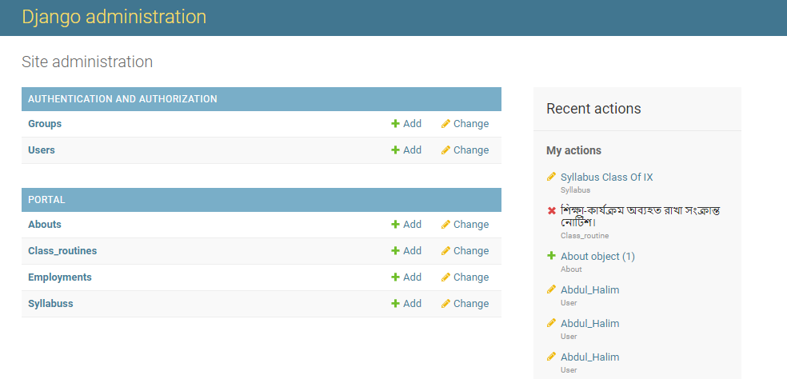

&nbsp;

&nbsp;

<strong></strong>

<strong>North South University</strong>

Department of Electrical &amp; Computer Engineering

<strong>Project Report</strong>

<strong>Group No</strong>: 06

<strong>Fall 2020</strong>

<strong>Project Name</strong>: STUDENT MANAGEMENT PORTAL

<strong>Course No</strong>: CSE 299 <strong>Sec</strong><strong>:</strong> 03

<strong>Faculty</strong>: Shaikh Shawon Arefin Shimon (Sas3)

<strong><u>Member</u></strong><u>:</u>

<strong>Name</strong><strong>:</strong> Fatin Fuad Karim

<strong>ID</strong><strong>:&nbsp; </strong>1621197642

<strong>Email</strong><strong>:</strong> <a href="mailto:">fatin.fuad@northsouth.edu</a>

<strong>Git Repository</strong><strong>: </strong><a href="https://github.com/NSU-FA20-CSE299-3/Group06">https://github.com/NSU-FA20-CSE299-3/Group06/</a>

<strong>Date Prepared</strong><strong>: </strong>21/01/2021

<strong>&nbsp;</strong>

<strong>&nbsp;</strong>

<h2> Project Name:  STUDENT MANAGEMENT PORTAL </h2> 
<h3 id="table-of-contents">Table of contents</h3>

<ol>
  <a href="">Introduction </a>
  <a href="">Software Specification </a>
  <a href="">Technology </a>
  <a href="">BusinessPlan/Monetization</a> 
  <a href="">Conclusion</a> 

</ol>
 

<h2 id="#introduction">1. Introduction</h2>
<h3>1.1 Project Idea:</h3>

We learn more about an academic institute by keeping track of their students. Due to Covid-19 pandemic our education system totally shifted online. Unfortunately, Most of the Schools in our country does not have a system to keep in touch with their students.
As a result, The teachers and students are almost disconnected from each other, On the other hand it seems due to Covid-19 educational institute will not open soon.
So there is no communication between the teachers and students, To create communication between them we have come up with School Management Portal.
Our mission is to connect all existing Students of a institution no matter where they are in this world with internet connection. Each students can find the latest educational update inside the website.
Student Management Portal is a web application built with the latest technologies, It will builds the connection between the teachers and students.

<h2 id="features">2. Software Specification</h2>
This project has the following features -
<h3>2.1 User Registration:</h3>
  To access any platform user's must have to registered by the authority, After completing the registration user will be given a username and password by which user can enter the portal.And it must contain 150 characters or fewer characters. Letters, digits and @/./+/-/_ are permitted only.
    
    
 

    
   Figure 1.0
 

 <h3>2.2 Login to a specific platform :</h3>
  The main feature of ‘STUDENT MANAGEMENT PORTAL’ is that users will be able to view different platforms on one window after logging in once. This section is know as the profile. The users information is shown on the left as seen in figure 2.0. 
   

  

   
  Figure 2.0

 
 
  
Currently the following functions are available -
  

    * Users/Teachers can access class routine, syllabus, exam routine section. 
    * Users/Teachers can add or delete their class routine, syllabus, exam routine.  
    * Users/Teachers will also be able to see posts of the specific class routine, syllabus, exam routine.
    

  

   
  Figure 3.0

  
<h3>2.3 Admin Panel:</h3>
There's also a Admin panel from which the admin can delete unwanted users. Assign new admins with filtered permission and monitor activities.

 
Figure 4.0

 <h2 id="#technology">3. Technology</h2>
 <h3>3.1 Proposed Technology Stack: </h3>
 
For UI design we decided to use Bootstrap. Bootstrap is a free and open-source CSS framework directed at responsive front-end web development. It contains CSS and JavaScript-based design templates for typography, forms, buttons, navigation and other interface components. Bootstrap will be used over the usual HTML and CSS.    
 And for the backend We will use Python’s web framework - Django as the website’s backend. Django hides website's source code. The framework has protection against XSS and CSRF attacks, SQL injections, clickjacking, etc. Django notifies of a number of common security mistakes better than PHP.   
On the other hand we will be using SQLite which is versatile and portable.

 

 <h3>3.2 Implemented Technology Stack: </h3>
 
We used Python’s web framework - Django as the website’s backend as we mentioned eariler in our proposal, On the other hand we used HTML,CSS and Bootstrap for our frontend design. 
 
For database we used SQLite

<h5>3.2.1 Design Pattern: </h5>
 
By default the Django framework follows the model-view-template pattern which a close immitation of the Model-view-controller. We decided to stay with this MVT pattern

<h2 id="businessplan">4. BusinessPlan/Monetization</h2>

As the web application is targeting the authority and students of the Schools, we will try to get fund from the school.
Companies can also place ads on the Portal for jobs charging 100 BDT per day. We will provide an advertisement package for such companies.

<h2>5. Conclusion</h2>

In summary Student Mangement Portal is a web-based software that tries to connect teachers and student together. In this project we achieved most of the functionalities proposed. Except to create the student portal and online admission system. We also didn't able to connect the sign in page with the database who are already registered by the admin and couldn't able to implement the ad sense.. During the development process we faced issues trying to create the model for academic section,connect all the pages with the base file, though later we solved it. In future, we plan to implement these missing functionalities,come up with better solution for the implementation and make the platform even better.

